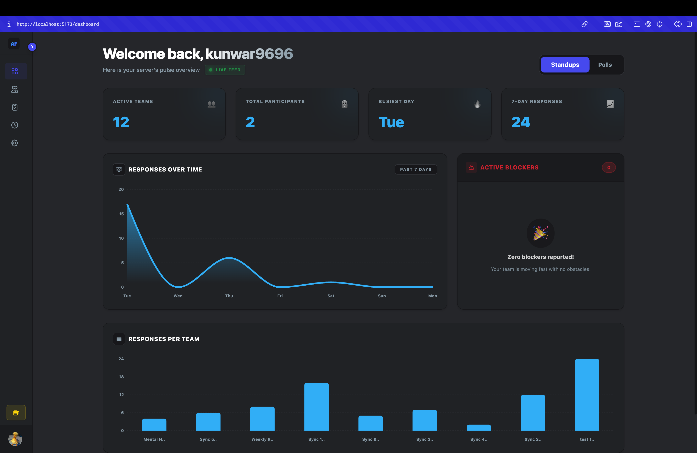
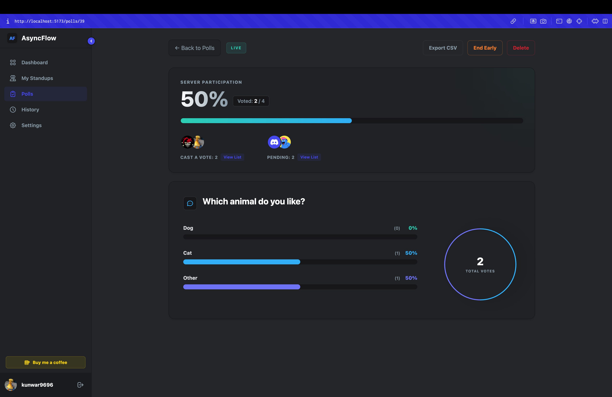
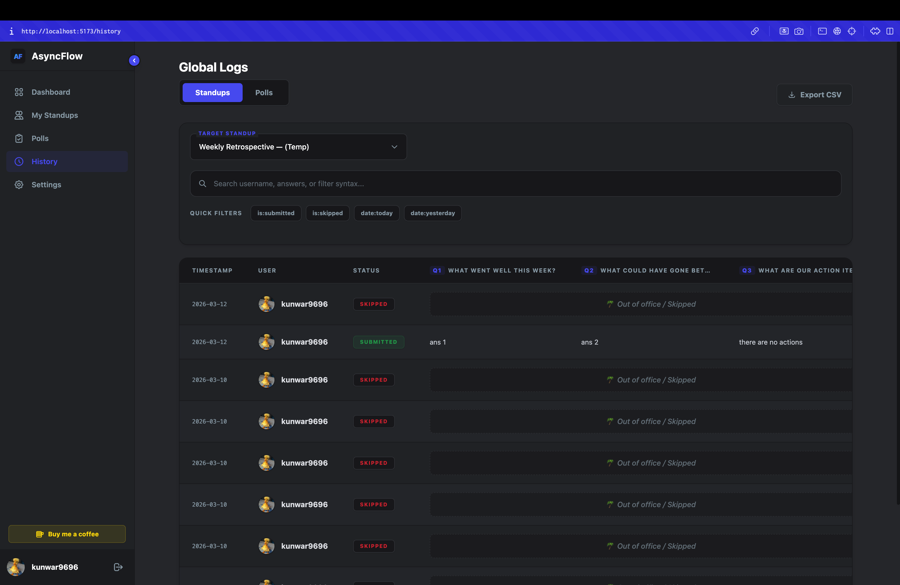

# 🤖 AsyncFlow

**AsyncFlow** is a modern asynchronous standup and team polling platform
built for **Discord communities and remote teams**.

It combines a **Discord bot** with a **web dashboard**, allowing teams
to share updates, track engagement, and run polls without needing
time-consuming synchronous meetings.

AsyncFlow helps teams stay aligned while keeping communication
**organized, automated, and frictionless**.

------------------------------------------------------------------------

# ✨ Features

## 📝 Smart Async Standups

-   **Custom Standup Workflows** -- Define questions like *"What did you
    do yesterday?"*, *"Any blockers?"*.
-   **Timezone-aware Prompts** -- The bot sends standup reminders based
    on each user's timezone.
-   **Threaded Daily Reports** -- Responses are automatically grouped
    into clean, date-stamped Discord threads.
-   **OOO / Skip Support** -- Members can mark themselves as
    out-of-office or skip a day with one click.

------------------------------------------------------------------------

## 🗳️ Interactive Team Polling

-   Create server-wide polls directly from the dashboard.
-   Track participation rates and view **real-time vote distribution**.
-   End or delete polls early with one click.

------------------------------------------------------------------------

## 📊 Developer Dashboard

-   **Discord OAuth Authentication**
-   **Team Engagement Analytics**
-   **CSV Export for Standup & Poll Data**
-   **Interactive Charts (Recharts)**
-   **Fully Responsive UI**

------------------------------------------------------------------------

# 🏗️ Architecture

    Frontend (React + Vite)
            │
            ▼
    Backend API (Go + GORM)
            │
     ┌───────────────┐
     │ PostgreSQL DB │
     └───────────────┘
            │
            ▼
    Redis (Caching / Standup State)
            │
            ▼
    Discord Bot (DiscordGo)

------------------------------------------------------------------------

# 🛠️ Tech Stack

## Frontend

-   React 18
-   Vite
-   TailwindCSS
-   React Router v6
-   Redux Toolkit / RTK Query
-   Recharts
-   @hello-pangea/dnd

## Backend

-   Go (Golang)
-   DiscordGo
-   GORM
-   Redis
-   PostgreSQL / MySQL

------------------------------------------------------------------------

# 📂 Project Structure

    asyncflow
    │
    ├── backend
    │   ├── cmd/server
    │   ├── internal
    │   │   ├── api
    │   │   ├── bot
    │   │   ├── database
    │   │   ├── models
    │   │   ├── services
    │   │   └── store
    │   └── config
    │
    ├── frontend
    │   ├── src
    │   │   ├── pages
    │   │   ├── components
    │   │   ├── features
    │   │   └── store
    │
    └── docs

------------------------------------------------------------------------

# 🚀 Getting Started

## Prerequisites

Install:

-   Go 1.20+
-   Node 18+
-   Redis
-   PostgreSQL / MySQL
-   Discord Bot Application

Create a bot here: https://discord.com/developers/applications

------------------------------------------------------------------------

# 1️⃣ Clone the Repository

``` bash
git clone https://github.com/yourusername/asyncflow.git
cd asyncflow
```

------------------------------------------------------------------------

# 2️⃣ Backend Setup

``` bash
cd backend
go mod download
```

Create `.env`

    DISCORD_BOT_TOKEN=
    DISCORD_CLIENT_ID=
    DISCORD_CLIENT_SECRET=

    DB_DSN=
    REDIS_ADDR=

    JWT_SECRET=
    FRONTEND_URL=http://localhost:5173

Run server:

``` bash
go run cmd/server/main.go
```

Server will start at:

    http://localhost:8080

------------------------------------------------------------------------

# 3️⃣ Frontend Setup

``` bash
cd frontend
npm install
```

Create `.env`

    VITE_API_BASE_URL=http://localhost:8080/api
    VITE_DISCORD_CLIENT_ID=

Start dev server:

``` bash
npm run dev
```

Frontend runs at:

    http://localhost:5173

------------------------------------------------------------------------

# 🌐 Deployment

### Frontend

Deploy on: - Vercel - Netlify

### Backend

Recommended: - Render - Fly.io - Railway

### Database

-   Neon
-   Supabase
-   PlanetScale

------------------------------------------------------------------------

# 📸 Screenshots





------------------------------------------------------------------------

# 🔐 Environment Variables

Backend:

  Variable                Description
  ----------------------- -------------------------------
  DISCORD_BOT_TOKEN       Bot token from Discord portal
  DISCORD_CLIENT_ID       OAuth client ID
  DISCORD_CLIENT_SECRET   OAuth secret
  DB_DSN                  Database connection string
  REDIS_ADDR              Redis connection
  JWT_SECRET              Secret for JWT authentication

Frontend:

  Variable                 Description
  ------------------------ -----------------
  VITE_API_BASE_URL        Backend API URL
  VITE_DISCORD_CLIENT_ID   OAuth client ID

------------------------------------------------------------------------

# 🤝 Contributing

    Fork the repository
    Create a branch
    git checkout -b feature/my-feature
    Commit changes
    git commit -m "Add feature"
    Push branch
    git push origin feature/my-feature
    Open Pull Request

------------------------------------------------------------------------

# ☕ Support

If AsyncFlow helped you, consider supporting the project.

------------------------------------------------------------------------

# 📄 License

MIT License

------------------------------------------------------------------------

# ⭐ Star the Repository

If you like this project, please give it a star ⭐
